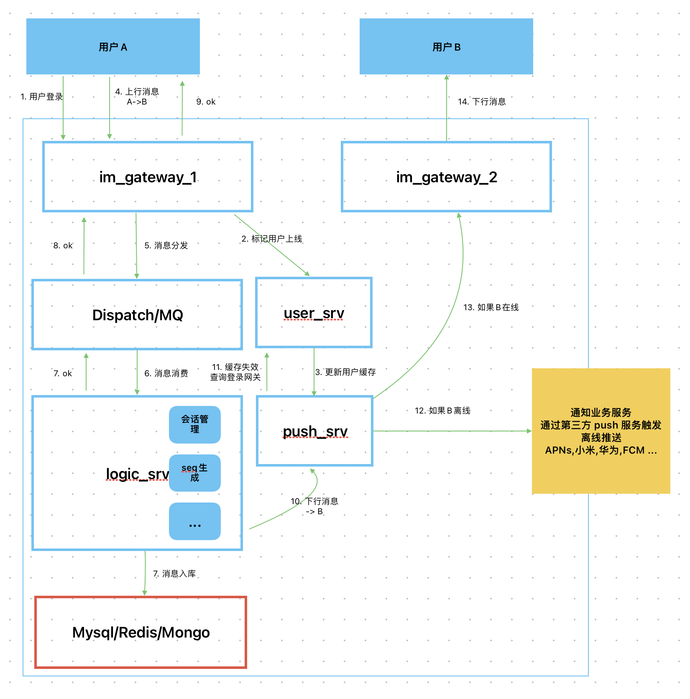

# 架构文档

从我的经验来看，IM系统最容易出现压力的两个地方：
1. 存储：数据库要做到能够存储海量数据和海量QPS
2. 下行消息路由：这里要尽可能设计成弹性的无状态的，优化手段是bufIo,一致性hash,网关自治等。

# 版本V1

## IM服务的组成
目前V1版本只考虑IM服务的核心功能。大致有以下几个核心服务。
### Gateway
主要用于长连接维持，消息解析，流量出入口，多协议支持等。

### Dispatch/Mq
这里可以考虑使用MQ作为消息的分发，如果用MQ的话，可以在MQ收到消息后就返回Ack

考虑到可能需要在消息分发的时候做一些自定义的处理和业务隔离的作用，单独抽取一层。

该模块主要用于消息分发。

### User
主要是用户的设备管理，以及在线状态的管理，以及鉴权等。

### Logic
主要是聊天的业务处理，黑名单，群关系，好友关系，消息存储，会话类型管理等

### Pusher
推送下行消息，该模块有一个缓存，依赖User去更新缓存。  
Push服务使用MQ进行缓存间的同步，把消息转发到对应的gateway。  
这里的重点是无状态的，当然考虑到缓存的数据量，可以采用一致性hash,把缓存在逻辑上划分。

### Api
一些HTTP接口，可用于设备的登录注册，会话管理等。
TODO：

### Webhook
在一些时机会调用外部系统的接口，比如消息接收方不在线，用户登录等。  
业务可以灵活的更加自己的需求做一些处理。

### 数据库
暂时考虑用mysql作为消息的存储，没有太深入的讲究。